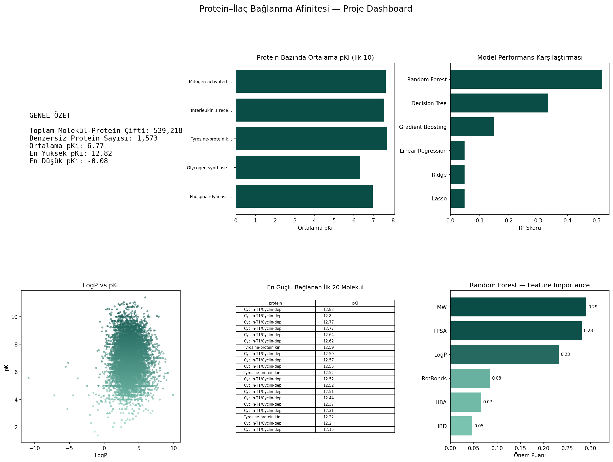

# Protein–Drug Binding Affinity Prediction

Predicting kinase–ligand binding affinity (pKi) from molecular structure alone, using data from BindingDB, Davis, and KIBA.

**Live dashboard:** https://protein-ilac-baglanma-afinitesi-tahmini.streamlit.app/



## Overview

Before a drug candidate reaches clinical trials, one of the earliest questions is how strongly it binds to its target protein. Measuring this experimentally is accurate but slow and expensive at scale.

This project asks whether binding affinity can instead be estimated from a molecule's own structural properties — molecular weight, LogP, polar surface area, and similar descriptors — without any lab experiment. The analysis is limited to kinase proteins, a widely studied drug target family, to keep the dataset biologically consistent.

The project covers the full pipeline: data collection and cleaning, exploratory analysis, statistical hypothesis testing, machine learning, and an interactive dashboard.

## Dataset

Built from three public sources:

| Source | Role |
|---|---|
| [BindingDB](https://www.bindingdb.org/) | Ki / IC50 / Kd values, filtered to kinase-related targets |
| [Davis](https://doi.org/10.1038/nbt.1990) | pKd values, already log-scaled |
| [KIBA](https://doi.org/10.1021/ci400709d) | Collected but excluded — uses a different composite scoring system not directly comparable to the other two |

All affinity values were converted to a common **pKi** scale:

```
pKi = -log10(value_nM / 1e9)
```

Six molecular descriptors were computed for every compound with **RDKit**: molecular weight (MW), LogP, topological polar surface area (TPSA), hydrogen bond donor count (HBD), hydrogen bond acceptor count (HBA), and rotatable bond count (RotBonds).

After cleaning, deduplication, and averaging repeated measurements, the final dataset contains:

- **539,218** molecule–protein pairs
- **1,573** unique proteins
- **10** columns: `SMILES`, `protein`, `source`, `pKi`, `MW`, `LogP`, `TPSA`, `HBD`, `HBA`, `RotBonds`

## Exploratory Analysis

Key findings before any modeling:

- The pKi distribution shows two sharp spikes at **5.0** and **7.0**. The 5.0 spike is largely a Davis dataset artifact — interactions below the assay's detection threshold are assigned a floor value of pKd = 5.0 rather than a real measurement.
- No individual descriptor shows a strong linear relationship with pKi.
- Different protein targets have visibly different pKi distributions, foreshadowing the hypothesis test results below.

## Hypothesis Testing

pKi is not normally distributed (Shapiro-Wilk test, p ≈ 0), so non-parametric tests were used throughout: Spearman correlation for each descriptor against pKi, and Kruskal-Wallis to compare pKi across protein targets.

| Hypothesis | Variable | Statistic | p-value | Result |
|---|---|---|---|---|
| H1 | MW vs pKi | ρ = 0.204 | ≈ 0.000 | Significant |
| H2 | LogP vs pKi | ρ = 0.010 | 2.37e-12 | Significant, negligible effect |
| H3 | TPSA vs pKi | ρ = 0.205 | ≈ 0.000 | Significant, opposite of expected direction |
| H4 | HBA vs pKi | ρ = 0.196 | ≈ 0.000 | Significant |
| H5 | Protein group vs pKi | H = 12,322.09 | ≈ 0.000 | Significant |

**H5 is the most important result in the whole project**: which protein a molecule is tested against affects pKi far more than any single molecular descriptor.

## Machine Learning

Six regression models were trained on the six molecular descriptors (80/20 train-test split):

| Model | Test R² | RMSE | MAE |
|---|---|---|---|
| **Random Forest** | **0.517** | **1.006** | **0.743** |
| Decision Tree | 0.334 | 1.182 | 0.826 |
| Gradient Boosting | 0.149 | 1.336 | 1.090 |
| Linear Regression | 0.049 | 1.413 | 1.159 |
| Ridge | 0.049 | 1.413 | 1.159 |
| Lasso | 0.048 | 1.413 | 1.161 |

Random Forest performed best but shows some overfitting (train R² = 0.800 vs. test R² = 0.517). Its feature importances (MW 0.29, TPSA 0.28, LogP 0.23, RotBonds 0.08, HBA 0.07, HBD 0.05) show that LogP contributes more through interaction effects than its near-zero individual correlation would suggest.

> XGBoost was originally planned but could not run on macOS due to a missing system dependency (`libomp`); Gradient Boosting was used instead as a comparable ensemble method.

### Why performance is capped around R² = 0.52

None of the six models use any information about the target protein — only the molecule's own descriptors. Given how strongly protein identity affects pKi (see H5 above), this is the most likely reason model performance plateaus around 50% explained variance. Adding protein-level features is the clearest path to improving accuracy.

## Interactive Dashboard

A Streamlit app (`app.py`) turns the analysis into an explorable tool:

- Filterable exploratory charts (pKi distribution, per-protein boxplot, variable scatter plot, correlation heatmap)
- Full hypothesis test results and explanations
- Model comparison and feature importance charts
- A live prediction tool — move sliders for MW, LogP, TPSA, HBD, HBA, and RotBonds to get an instant pKi prediction from the trained Random Forest model

**Try it live:** https://protein-ilac-baglanma-afinitesi-tahmini.streamlit.app/

### Running it locally

```bash
git clone https://github.com/cekereklibeyza/protein-ilac-baglanma-afinitesi-tahmini.git
cd protein-ilac-baglanma-afinitesi-tahmini
python3 -m venv venv
source venv/bin/activate        # Windows: venv\Scripts\activate
pip install -r requirements.txt
streamlit run app.py
```

## Project Structure

```
.
├── app.py                          # Streamlit dashboard
├── protein_ilac_baslangic.ipynb    # Full analysis notebook (cleaning, EDA, stats, ML)
├── requirements.txt
├── dashboard.png                   # Static dashboard preview
├── .streamlit/
│   └── config.toml                 # Theme
└── data/
    └── combined_clean.csv.gz       # Final cleaned dataset (compressed)
```

## Limitations

- BindingDB was filtered to records with "kinase" in the target name — findings are specific to the kinase family and don't generalize to all proteins.
- Ki, IC50, and Kd are different experimental measurement types, biochemically not fully equivalent, but combined here on a common pKi scale.
- Censored values (`<` / `>`) were stripped and treated as point estimates.
- The Davis pKd = 5.0 floor is a convention for sub-threshold binding, not a real measurement.
- KIBA was collected but excluded due to its incompatible scoring system.
- Machine learning models use only ligand-based 2D descriptors — protein identity is not included, which is the single biggest limitation on model performance.
- Gradient Boosting was used in place of XGBoost due to an environment constraint.

## References

1. Davis, M. I. et al. (2011). Comprehensive analysis of kinase inhibitor selectivity. *Nature Biotechnology*, 29(11), 1046–1051.
2. Lipinski, C. A. et al. (1997). Experimental and computational approaches to estimate solubility and permeability in drug discovery and development settings. *Advanced Drug Delivery Reviews*, 23(1–3), 3–25.
3. Liu, T. et al. (2007). BindingDB: a web-accessible database of experimentally determined protein–ligand binding affinities. *Nucleic Acids Research*, 35, D198–D201.
4. Öztürk, H., Özgür, A., & Ozkirimli, E. (2018). DeepDTA: deep drug–target binding affinity prediction. *Bioinformatics*, 34(17), i821–i829.
5. Svetnik, V. et al. (2003). Random forest: a classification and regression tool for compound classification and QSAR modeling. *Journal of Chemical Information and Computer Sciences*, 43(6), 1947–1958.
6. Tang, J. et al. (2014). Making sense of large-scale kinase inhibitor bioactivity data sets: a comparative and integrative analysis. *Journal of Chemical Information and Modeling*, 54(3), 735–743.

## Author

**Beyza Fatıma Çekerekli**
Data Analytics Project, 2026
